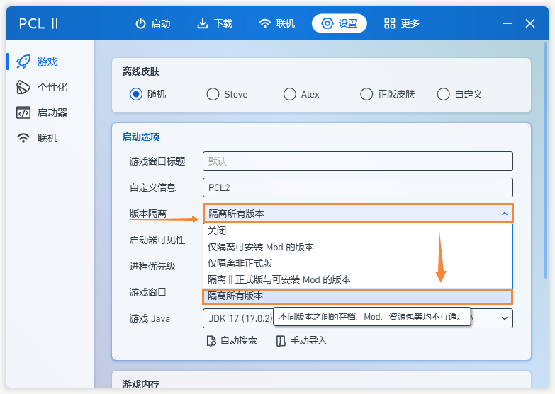

# 你应该明白这些

## 什么是版本隔离  

> **版本隔离** 顾名思义,就是将各版本的资源包、模组隔离到不同的文件夹.  
> 就像你买了一袋子鸡蛋,放在一起它们很有可能互相碰撞导致破碎,分开会减少破碎的可能.  
> **版本隔离** 也是相同的道理.所以建议大家开启.  
> 

## 如何安装模组

## 如何安装光影

## 什么是外置登录

## 如何与朋友联机

> 首先请确保你已经阅读了Forge安装教程  
> 
> 一个人些许有些寂寞?想要与朋友一起玩?我们在这里暂且给出**4**种方案. 

### 1.使用[PCL2启动器](https://wwx.lanzoum.com/ixJnZ01hkvfa)联机

>

### 2.使用[游侠对战平台](https://pk.ali213.net/) 

>

### 3.使用[樱花映射](https://www.natfrp.com/) 

>

### 4.使用[网易版我的世界](http://mc.163.com/)

>

