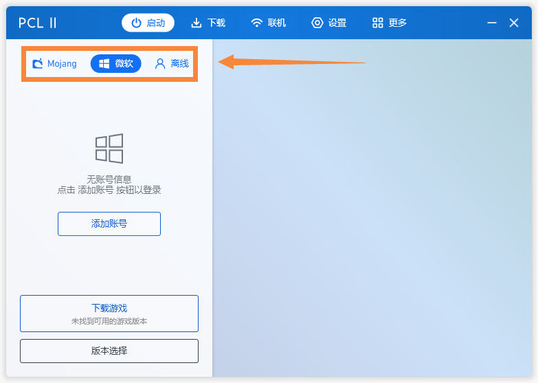
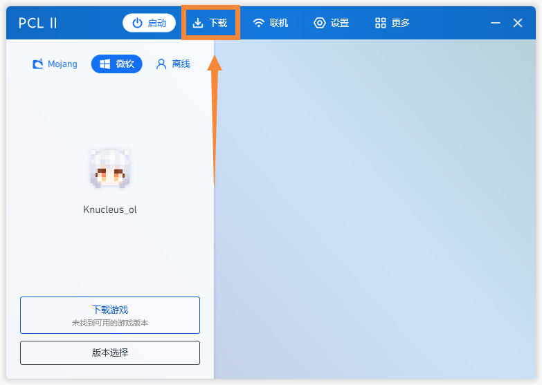
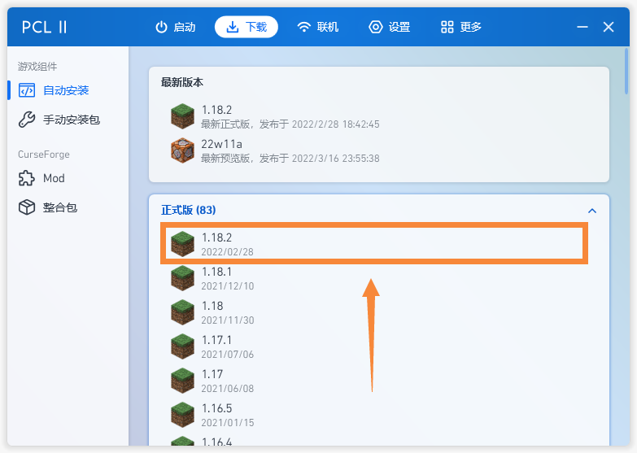
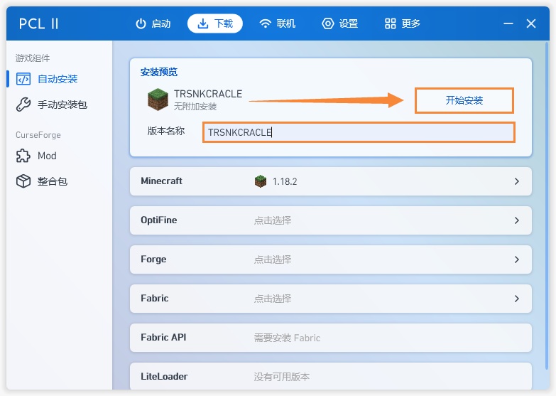

# 如何下载并运行游戏

?> 准备 对应游戏版本的Java、启动器
> Java是MC的运行的必备品,就像汽车离不开发动机一样.  
> 你可以去[**Java下载**](D4/4-1)来寻找适合对应版本的Java(MC的版本不同,所需Java的版本也就不同)  
>   
> `1.16.5以及1.16.5`以下需要`Java8`来运行,`1.16.5`以上则需要`Java17`来运行.
   
> 启动器,顾名思义,是来启动游戏的,如果说Java是MC的发动机那么启动器就是车钥匙.  
> 你可以去[**启动器下载**](D4/4-2)寻找你想要的启动器.  
> 每个启动器有些许差别,但只要的是它是否支持你的系统.  
> (`PCL2支持Windows,HMCL支持Windows、Linux、Mac,Alicorn支持Windows、Linux)
>   
> 鉴于国内访问国外资源慢的缘故,优先推荐PCL2,HMCL,Alicorn.  

?> 离线模式的名称最好使用英文名,否则你可能会遇到许多麻烦~

> 运行启动器后,选择你的登录方式进行登录.(这里以PCL2做演示)
> 
>  
> 点击下载选项卡.
> 
>
> 在下载选项卡中选择你要游玩的版本.
> 
>
> 此处可以修改版本昵称,防止在版本隔离的情况下出现些错误.
>  
> 
> 工欲善其事必先利其器,恭喜你,已经学会如何运用启动器下载并启动游戏.  
> 这就像你将钥匙插入,成功发动了汽车,成功迈出了第一步!