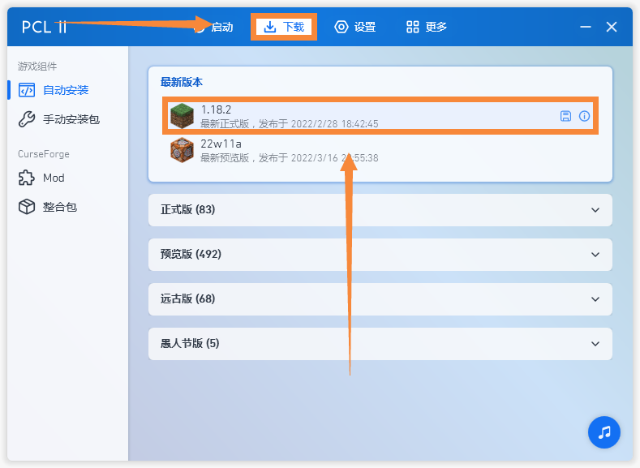
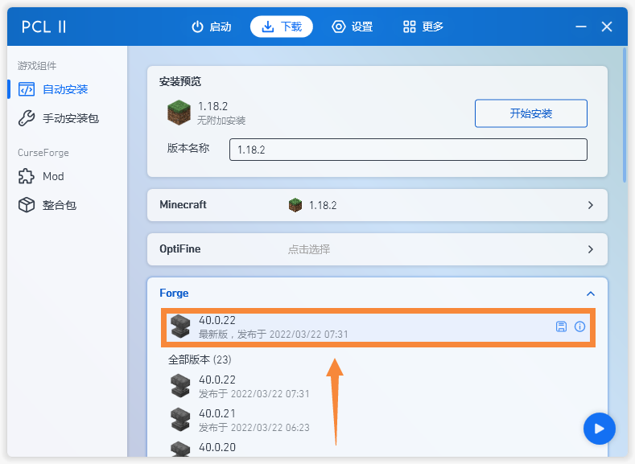
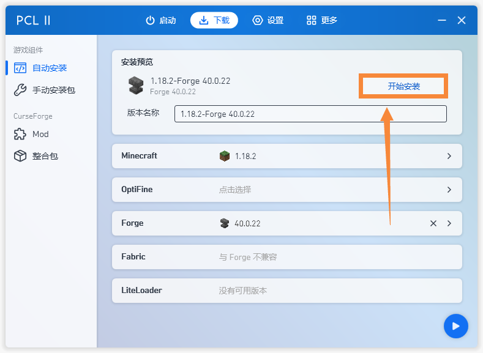

# 如何安装模组

!> 本条目需要等待整改,正在施工中...

## Forge与Fabric
> 想要安装模组,前提你需要一个"模组加载器",目前主流的"模组加载器"分别是**Forge**和**Fabric**.

> **Forge**,老牌API(你甚至能在远古版本看到它的身影),95%的大型模组都在使用,以极多的模组含量和强大的功能出名,但因为这种强大导致它过于臃肿,在这个版本的更迭的时代,Forge面临着难产的问题.
>
> **Fabric**,新兴起的API,越来越多的模组开始选择它,是一个轻量级模组加载器,以更新快,前后兼容度高为特点,多用于以优化游戏体验为目地的模组,如著名的锂、钠、磷等优化模组,投影等生存辅助模组.

## Forge加载器的安装

<!-- tabs:start -->
# **自动安装**
> 打开启动器,(这里以PCL2启动器演示)
>
> 点击下载选项,选择你要游玩的版本.
>
>
> 点击Forge选项卡.
>
>
> 点击下载最新版即可.
>
> 
> 点击开始安装,等待安装完成即可.
>

# **手动安装**

<!-- tabs:end -->

## Fabric加载器的安装
<!-- tabs:start -->
# **自动安装**

# **手动安装**

<!-- tabs:end -->