# 如何安装光影

## 认识光影核心

**目前主流的光影核心有**:
<!-- tabs:start -->

# **Optifine(高清修复)——Forge/Fabric**
> 
>推荐适用版本：1.8.7——1.16.5
> 
>推荐原因：既有光影核心的功能又能优化游戏内容,非常实用.
> 
>>ps：在1.8.7之前的Optifine是不带有光影核心的功能的.

# **Iris Shaders(虹)——Fabric**
> 
>推荐适用版本：1.16.5——更高的版本
> 
>推荐原因：适用于高版本的Fabric安装光影,能与Sodium（钠）配合使用

# **shaders-mod——Forge**
> 
>推荐适用版本：更老的版本——1.10
> 
>推荐原因：在老版本能流畅的安装光影.

<!-- tabs:end -->

## 光影核心的安装教程

**第一部分**
<!-- tabs:start -->

# **Optifine（自动注入）**
>  
>1.打开启动器（这边使用的是PCL2进行演示）
>  
>2.点击下载选项,选择你要游玩的版本
>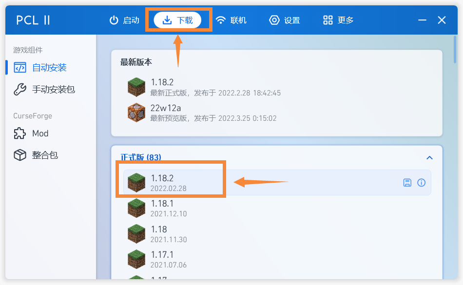
>   
>3.点击“Optifine”选项,选择最新的版本,并点击安装
>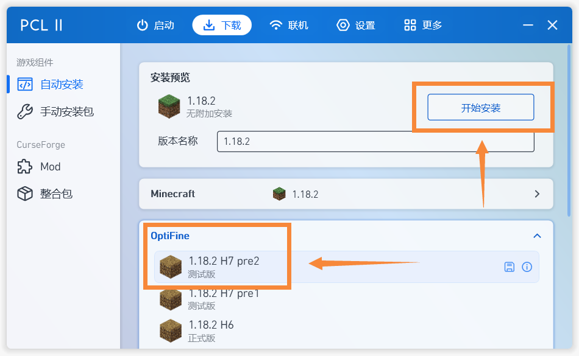
> 
>4.打开游戏,再退出,/.minecraft文件夹中便会出现/shaderpacks文件夹

# **Optifine（手动注入）**
>
>1.[下载Optifine（点我跳转链接)](https://optifine.net/downloads)
>
>2.选择需要的版本，并点击下载
>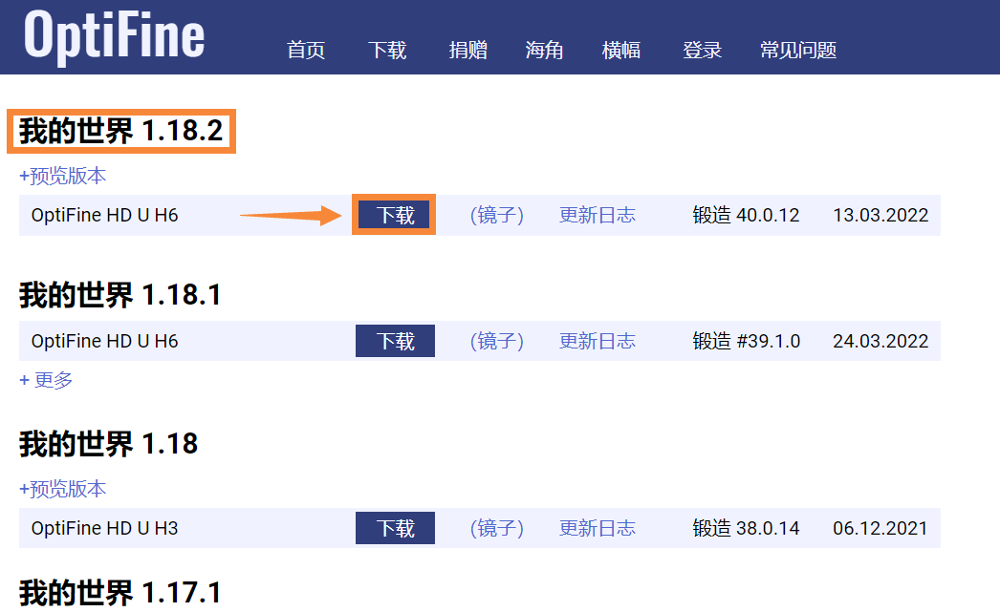
>
>3.将下载好的文件放入/.minecraft文件夹中
>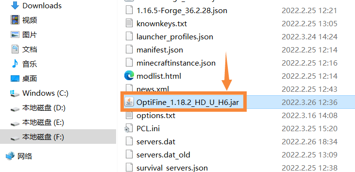
>
>4.双击安装包，点击三个点，选择/.minecraft文件夹，最后点击“Install”安装
>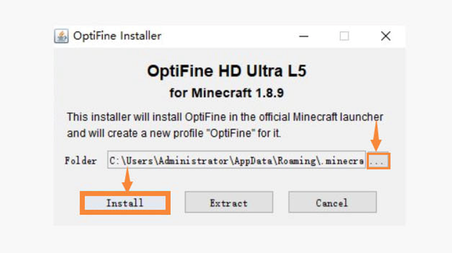
>
>5.打开游戏,再退出,Optifine便安装完毕，/.minecraft文件夹中也将会出现/shaderpacks文件夹

# **Optifine（模组形式）**
> 
>1.打开启动器（这边使用的是PCL2进行演示）
> 
>2.下载Forge（下载教程在上文“如何下载Forge”中,请认真观看后再进行下一步）
> 
>3.点击手动下载选项,找到“Optifine”
>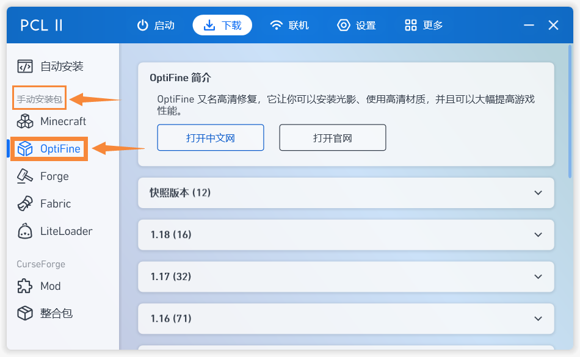
>  
>4.选择对应的版本,并点击下载
>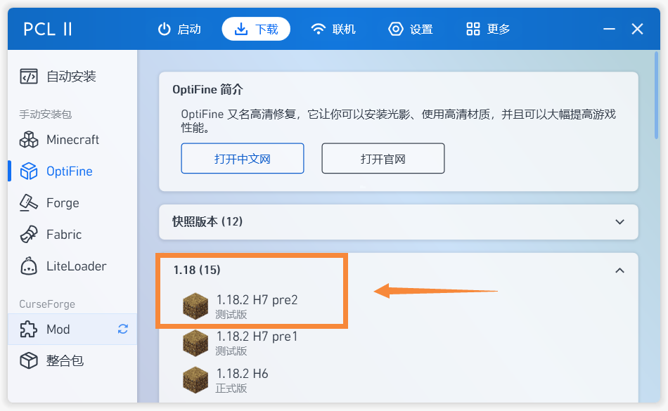
> 
>5.将Optifine下载到/mods文件夹
>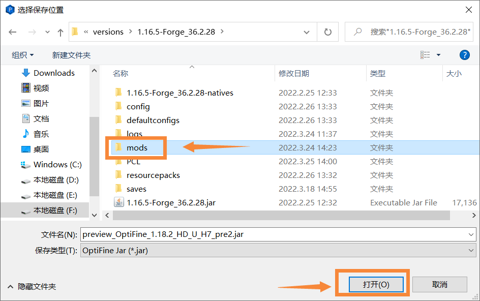
> 
>6.打开游戏,再退出,Optifine就安装成功了,/.minecraft文件夹中将会出现/shaderpacks文件夹

<!-- tabs:end -->

**第二部分**
<!-- tabs:start -->
# **Iris Shaders**
>1.打开启动器（这边使用的是PCL2进行演示）
> 
>2.下载Fabric（下载教程在上文“如何下载Fabric”中,请认真观看后再进行下一步）
> 
>3.[下载Iris Shaders（点击我跳转链接）](https://irisshaders.net/)
>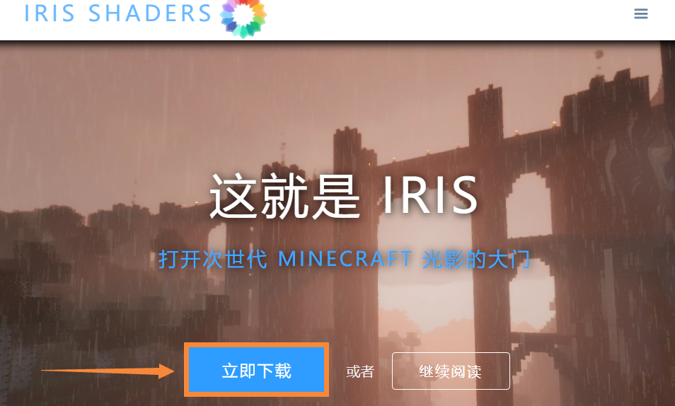
> 
>4.将所下的Iris Shaders放入/mods文件夹
>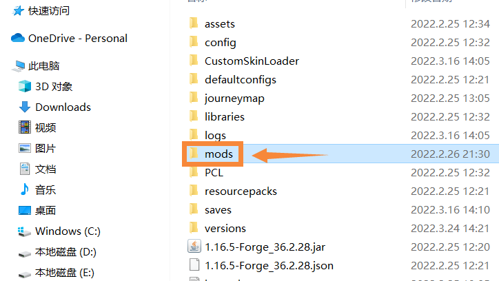
> 
>5.打开游戏,再退出,/.minecraft文件夹中便会出现/shaderpacks文件夹

# **shaders-mod**
>1.打开启动器（这边使用的是PCL2进行演示）
> 
>2.下载Forge（下载教程在上文“如何下载Forge”中,请认真观看后再进行下一步）
> 
>3.[下载shaders-mod（点我跳转链接）](https://shadersmods.com/shaders-mod/)
>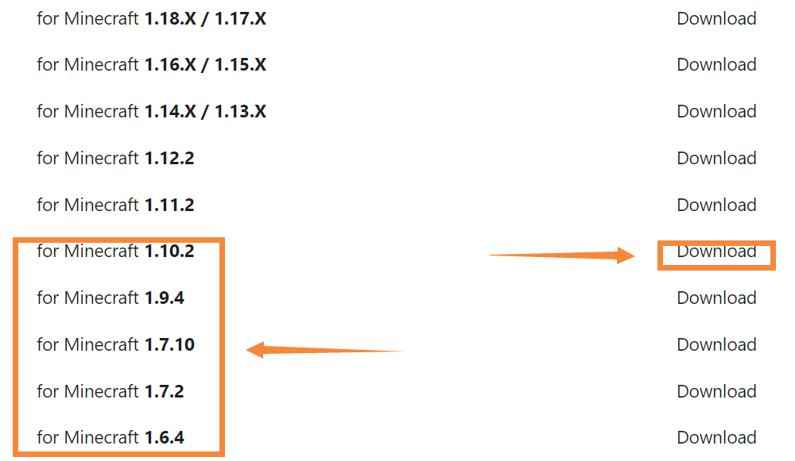
>
>4.将所下的shaders-mod放入/mods文件夹
>
>
>5.打开游戏,再退出,/.minecraft文件夹中便会出现/shaderpacks文件夹

<!-- tabs:end -->

## 光影的使用方法

>1.将所下的光影放入/shaderpacks文件夹中
>
>2.打开游戏
>
>3.点击设置,再点击视频设置
>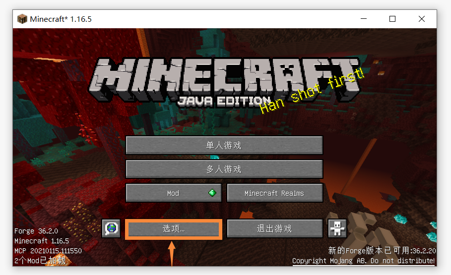
>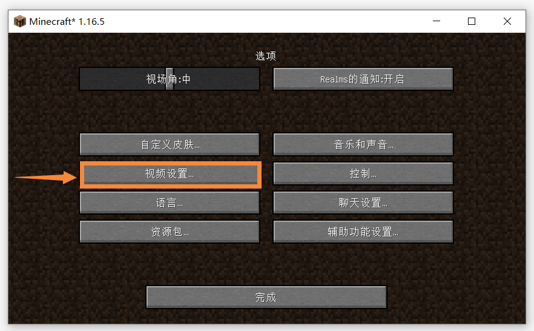
>
>4.点击光影选项,并选择所下的光影
>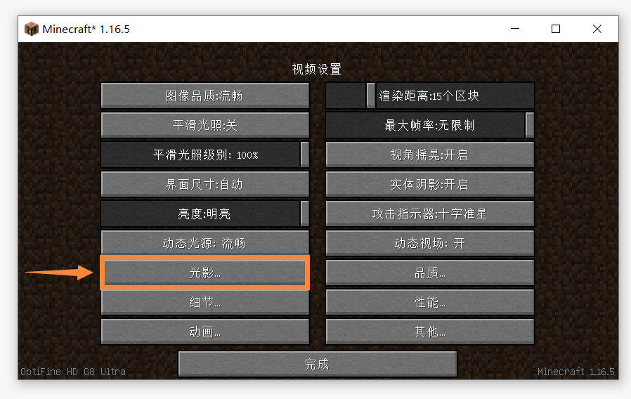

## 注意事项
>1.注意所下光影支持的版本是否与游戏版本相同
>
>2.请注意所下的光影核心支持的版本是否与游戏版本相同
>
>3.请注意所下的光影核心使用的是什么API（如Forge和Fabric）
>
>4.请注意不要将光影谁便找一个文件夹就塞进去,一定要放入/shaderpacks文件夹中