# 如何与朋友联机

> 首先请确保你已经阅读了Forge安装教程  
> 
> 一个人些许有些寂寞?想要与朋友一起玩?我们在这里暂且给出**4**种方案. 

!> 联机前请确认玩家和房主游戏版本抱持一致.  
   若游戏带有模组,则模组和Forge、Fabric版本也要完全一致.

## 使用[PCL2启动器](https://wwx.lanzoum.com/ixJnZ01hkvfa)联机
  `你`需要做的事情只有九步.
<!-- tabs:start -->
# **第一步**
> `你`打开启动器,点击联机选项卡,复制连接码
> 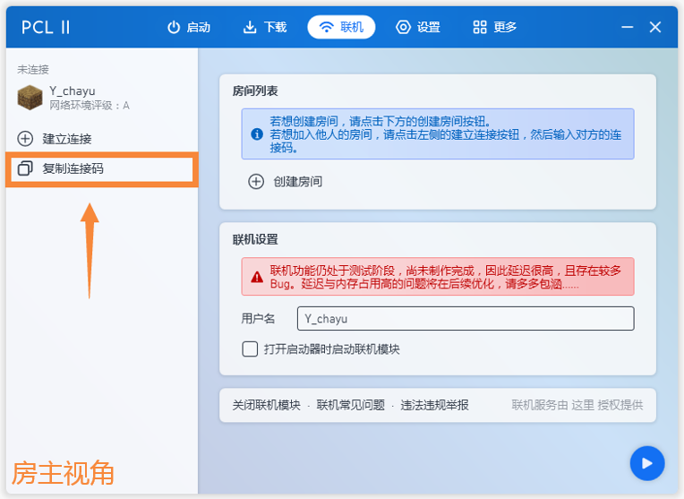
# **第二步**
> `你`将连接码发送给要联机的好友.
> 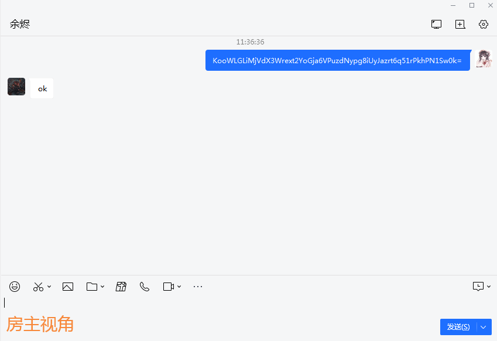
# **第三步**
>  `你`进入游戏后,按<kbd>ESC</kbd>键,开启对局域网开放.
> 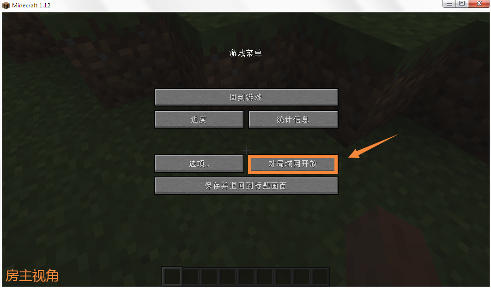
# **第四步**
> `你`点击创建一个局域网世界.
> 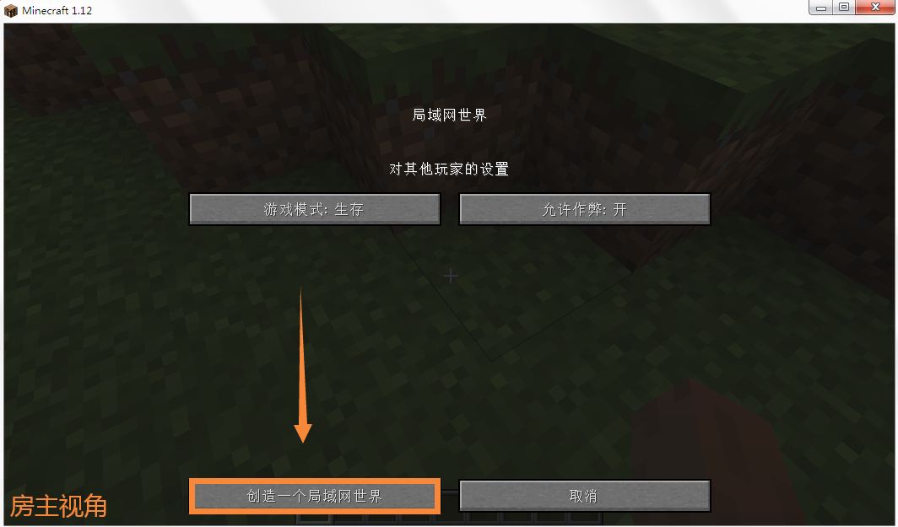
# **第五步**
> `你`记住下方端口号(端口号是不同的,不要抄图片中的哦~)
> 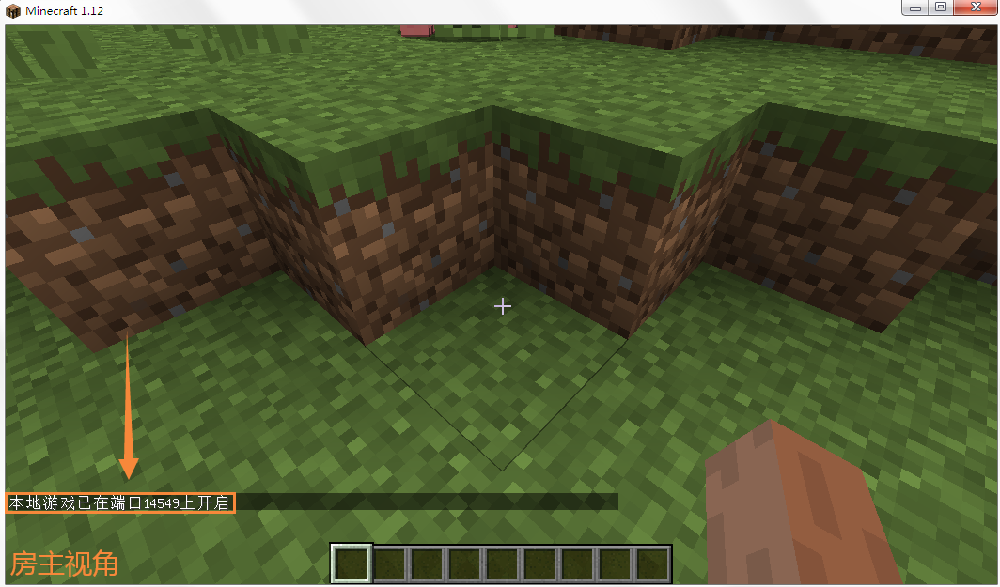
# **第六步**
> `你`回到PCL2,点击创建房间.
> 
# **第七步**
> `你`点击继续.
> 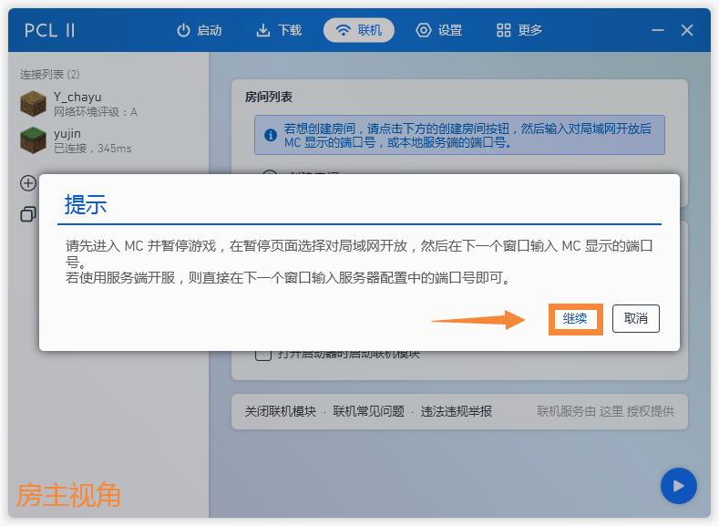  
# **第八步**
> `你`输入刚刚记下的端口号,点击确定.
> 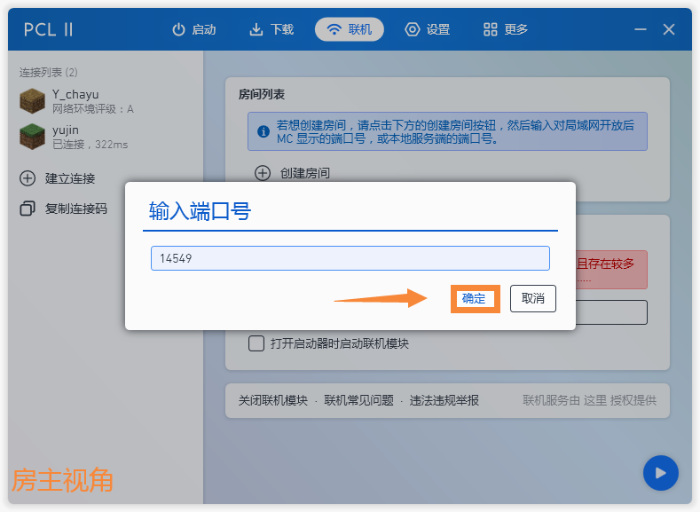
# **第九步**
> 房间名默认即可(到这一步,`你`的操作结束了.)
> 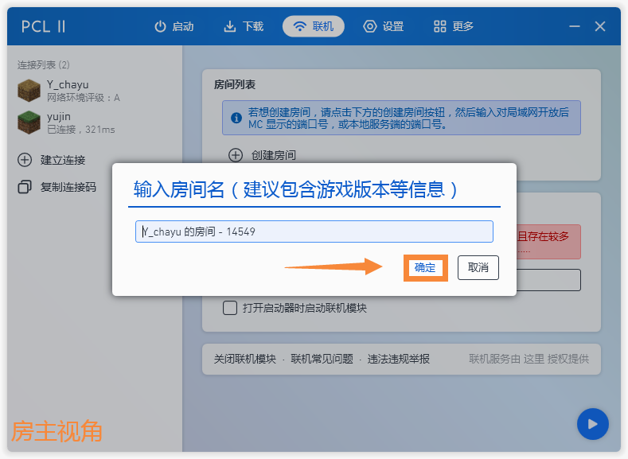
<!-- tabs:end -->

  `朋友`需要做的事情只有四步.
<!-- tabs:start -->
# **第一步**
> `朋友`复制刚刚发来的连接码,点击建立连接,粘贴后点击确定.
> 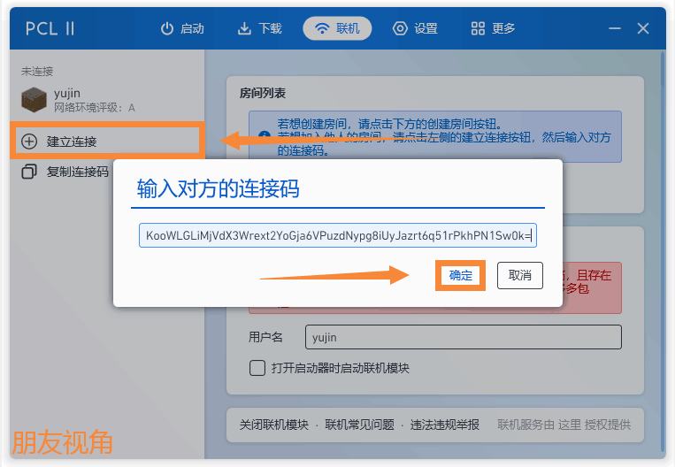 
# **第二步**
> `朋友`点击房间,点击复制.  
> 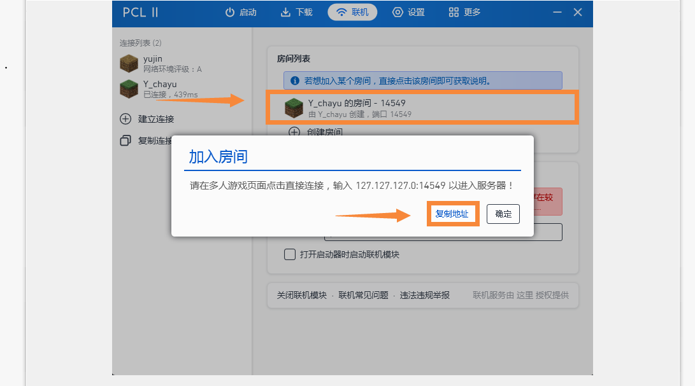
# **第三步**
> `朋友`进入游戏,点击多人游戏.  
>   
# **第四步**
> `朋友`点击直接连接,将刚刚复制的IP地址粘贴,点击加入服务器即可.
> 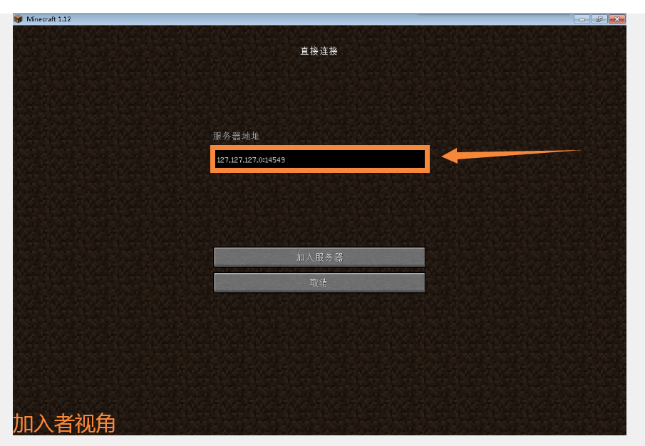  
<!-- tabs:end -->

## 使用[游侠对战平台](https://pk.ali213.net/) 

>

## 使用[樱花隧道映射](https://www.natfrp.com/) 

>

## 使用[网易版我的世界](http://mc.163.com/)

>

