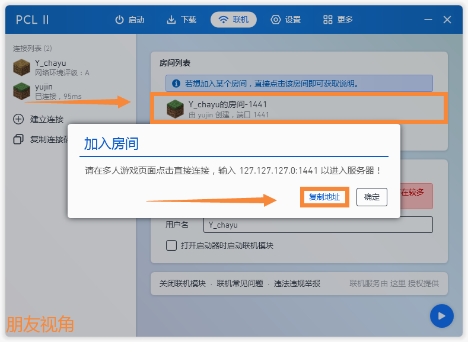
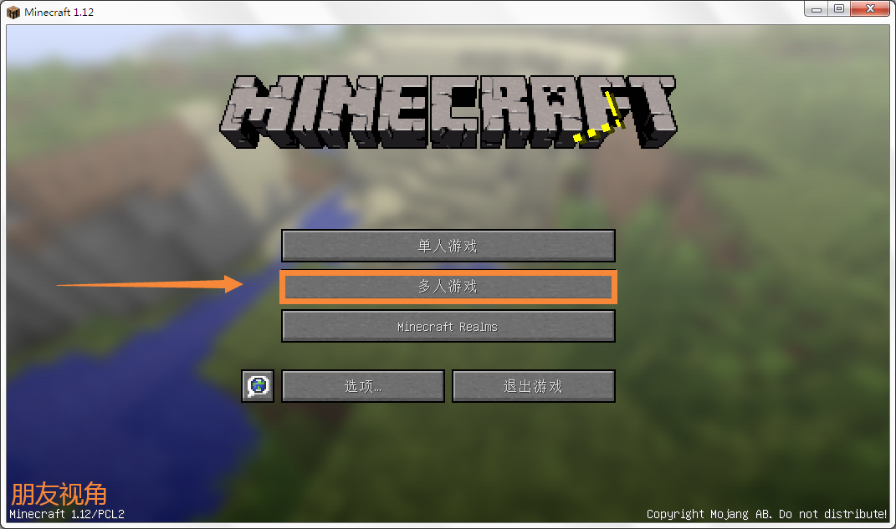

# 如何与朋友联机

> 首先请确保你已经阅读了Forge安装教程  
> 
> 一个人些许有些寂寞?想要与朋友一起玩?我们在这里暂且给出**4**种方案. 

## 使用[PCL2启动器](https://wwx.lanzoum.com/ixJnZ01hkvfa)联机

!> 联机前请确认玩家和房主游戏版本抱持一致.  
   若游戏带有模组,则模组和Forge、Fabric版本也要完全一致.
> 首先你需要下载好PCL2启动器,可以点击上方下载.
> 打开启动器,点击联机选项卡,等待加载完成后,点击复制连接码.  
>   
>  
> 将连接码发送给要联机的好友.  
>   
>   
>
> 加入者复制刚刚的连接码,点击建立连接,粘贴后点击确定.
>  
>  
> 房主进入游戏后,点击Esc,点击对局域网开放.  
>   
>
> 点击创建一个局域网世界.  
>   
>
> 记住下方端口号(注意,端口号是不同的,不要抄图片中的哦~)  
>   
>
> 回到PCL2,点击创建房间.
> 
>
> 点击继续. 
>   
>
> 输入刚刚记下的端口号,点击确定.  
>   
> 
> 房间名默认即可.  
> 
>
> 加入者点击房间,点击复制.  
> 
>
> 进入游戏,点击多人游戏.  
>   
>
>点击直接连接,将刚刚复制的IP粘贴,点击加入服务器即可.
>   
> 好啦,PCL2的连接方法就是这样啦~
>
## 使用[游侠对战平台](https://pk.ali213.net/) 

>

## 使用[樱花隧道映射](https://www.natfrp.com/) 

>

## 使用[网易版我的世界](http://mc.163.com/)

>

