# 架设服务器

!> 国内服务器处于饱和状态,想要圈钱看看自己的服配不配,本人拒绝向**垃圾**的服务器提供**任何**帮助!

## 学前概念理解

<!-- tabs:start -->
# **IP地址(IP Address)**
> 就像你家的详细地址,你的电脑在互联网中也有属于自己的地址,这个地址就是IP地址.
> 

# **公网与内网**
  **内网**

>
> 一般地,内网就是局域网的俗称.局域网可以是两台设备组成,也可以是成百上千台设备.
 小到一个家庭,大到一个公司都可以是内网.局域网一般相对封闭,在局域网内,用户可以共享文件和设备等.
>
> 你的内网ip可以在命令提示符( 终端 )中通过**ipconfig**命令查看.
>  
> 首先打开命令行或PowerShell,两者没有什么不同.通过运行(Ctrl + R),输入cmd,回车打开命令行.
>
> 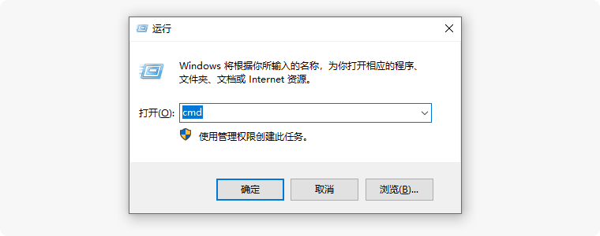
> 
> 或右键任务栏windows图标,选择"Windows PowerShell(管理员)",会打开这样的窗口.
>
> 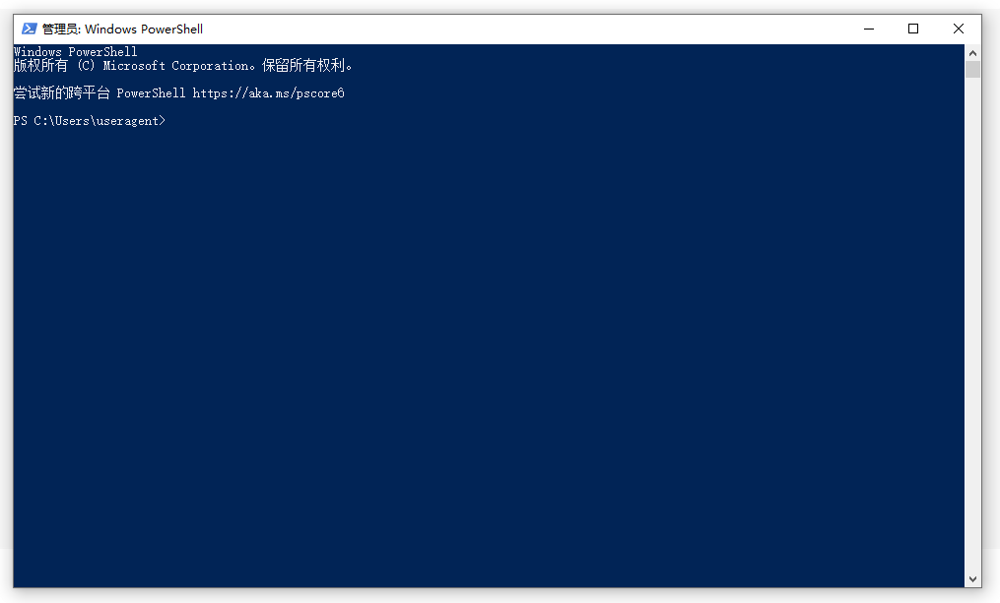
>
> 输入**ipconfig**,并回车.
>
> 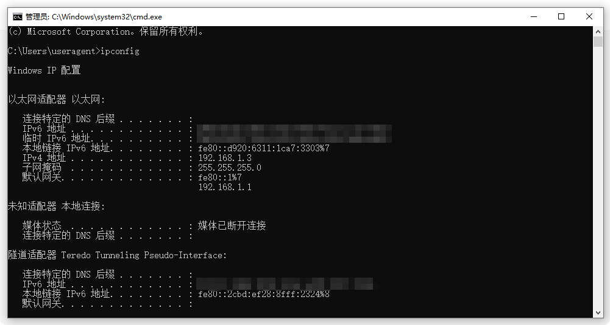
> 
> 在"IPv4地址"后时你在局域网内的地址.
>

  **公网**

>
> 公网范围很大,得到了公网地址,你的朋友们可以直接通过公网IP访问你的服务器(或局域网游戏).否则,你需要通过其他技术来使得你的网络可以被访问.
>
> 外网ip需要通过网络运营商的一些手续获得,所以一般的网络用户是不能接受外网的访问.一级运营商(电信和联通)有更大可能获得.
>
> 当你获得独立的公网ip后,你可以通过百度获取你的ip.不过这个IP是动态的, 重启光猫或路由器会随机重置.
> 
# **端口(Port)**
>
> 如果将IP比作地址的话,那么端口就是你家的门牌号.
>
> 应用会像操作系统报告以获取一个可用的端口, 例如:打开游戏并打开了局域网共享, 配置了内网穿透,却忘了配置端口.
这就像你的朋友知道你家在哪个小区, 却不知道他家住在几号楼, 哪个房间.
>
> 每个使用网络的应用都有端口.
> 
> 游戏内开启局域网的端口提示:
>
> 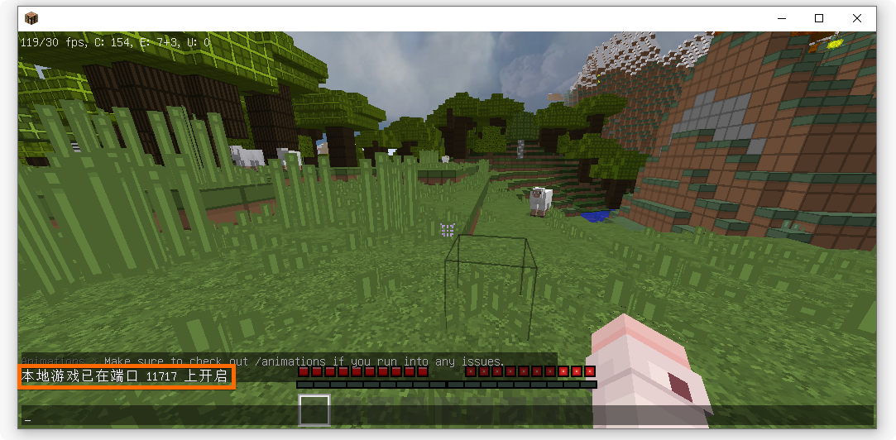
>
# **环回地址**
>
> 127.0.0.1,通常被称为本地回环地址 (Loopback Address) ,不属于任何一个有类别地址类.它代表设备的本地虚拟接口,所以默认被看作是永远不会宕掉的接口.
>
> 作用:
> 1. 测试本机的网络配置.
> 能ping通说明本机的ip协议没有安装错误.
> 
> 1. 在同一台设备上同时运行服务端和客户端,可以将 127.0.0.1 当作服务端的网络地址.
> 
> 你还可以在hosts文件中使得localhost解析为127.0.0.1
> 
# **根目录**
> 假如你在桌面新建`Server`文件夹用来开服,那么`Server`文件夹的地址就是根目录.
 
# **TPS与MSPT**
> 像许多大型游戏一样,Minecraft也是由一个大的循环系统不断运行着的,像这样的一个循环被称为一刻(Tick).刻的发生意味着许多事,例如判定的发生和系统的一次运转.
>   
> 默认情况下,Minecraft每秒会执行20刻,即使计算机有能力执行更多刻,但Minecraft限制了一刻的最短时间为0.05秒.  
>   
> 当世界中有太多事件或实体,导致0.05秒内无法执行完一刻时,一刻的时间就会变长.因此,游戏一秒能执行多少刻就成了性能评估和诊断的关键.
>     
> TPS,全称Ticks Per Second,刻/秒,表示游戏一秒中能执行多少刻.默认情况也就是最好情况下是20.0.越高表示游戏越流畅.  
>   
> MSPT,全称Millisecond Per Tick,毫秒/刻,表示一刻平均需要多长时间执行.越低越好.与TPS不能超过20的限制不同的是,MSPT表示的是一刻需要多长时间运行,而不是一刻持续的时间.因此MSPT可以小于50.  
>   
> 若游戏出现上面的一刻过长的情况时,TPS就会下降,MSPT就会上升.
<!-- tabs:end -->

## 什么是服务器
> 
> 为了防止歧义,首先声明,我们所说的`服务器`不是指真正的`物理服务器`.  
> 而是指在`物理服务器`基础之上运行的我的世界服务器`软件`.
>  
> 联机固有联机的便捷性,但是它无法实现像专业服务器的功能多样性和可定制性.
> 
> 服务器可以添加插件进行管理,经济,娱乐等原版客户端所不具有的功能
> 
> 服务器可以由几个子服务器组成,它们使用代理服务端连接成网, 玩家可以在这些服务器中传送,
这是局域网联机不能实现的.
> 
> 服务端( 子服务器 )是大型服务器的基本组成部分.
>

## 服务器核心的故事
>
> **原版服务端 --> Bukkit --> Spigot --> Paper --> 其他服务端.**
>  
> 起初,只有原版服务端,玩家们也感觉逐渐变得无聊起来,想要新的玩法. Bukkit大佬通过反编译Minecraft,修改原版服务端形成了Bukkit服务端.
 Bukkit API(应用程序编程接口: 可以理解为电脑的USB插口,可以外接设备) 代码规范也就确定了.
> 
> 可是Bukkit做不下去了, 因为它使用了Mojang的源代码, 被Mojang告上了法庭.意料之中, Bukkit败诉了,项目被迫停止.
>
> Bukkit败诉后,开发者肯定不乐意了,自己辛辛苦苦做出来的插件竟然不能用.于是他们想到了一个绝好的注意,
 既然不能修改之后发布,那就教你怎么修改,自己修改.发布了一个不包含Minecraft源代码的部署工具.
>
> 要使用时,这个工具会在服主的计算机上下载一份 Minecraft 客户端,完成反编译、注入、重新编译、打包等工作.就像一个安装程序一样.
你可能见到过的 BuildTools.jar 就是它.
>
> 命名为Bukkit不太好操作, 于是就起了一个新名字: `Spigot`.于是,Bukkit API 和 Spigot API 都被打包进 BuileTools.jar 了,这就是Spigot服务端.
> 
> Paper觉得Spigot运行太慢了,于是又把自己的API放了进去.这便是Paper服务端.
> 
## 服务器核心区别
!> 此页待补充......
>
> Bukkit, Spigot, Paper是相互嵌套的关系.就是说Bukkit适配的插件,Spigot 和 Paper 一定适配.
 但是Spigot适配的插件,不一定适配Bukkit.因为这个插件可能使用了Spigot API ,而Bukkit服务端没有
 Spigot API.
> 
## 如何简单架设服务器
>
> 1.首先你需要获取服务端文件( 这里以原版服务端为例 ) [最新服务端获取地址](https://www.minecraft.net/en-us/download/server) .
>
> 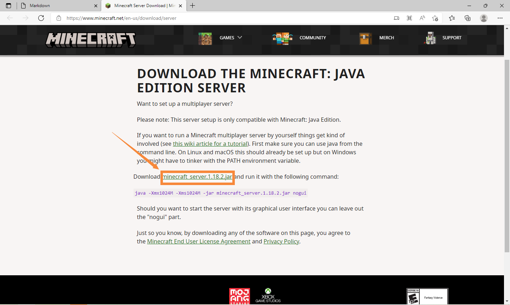
>
> 2.然后在服务端所在文件夹打开命令行.
>
> 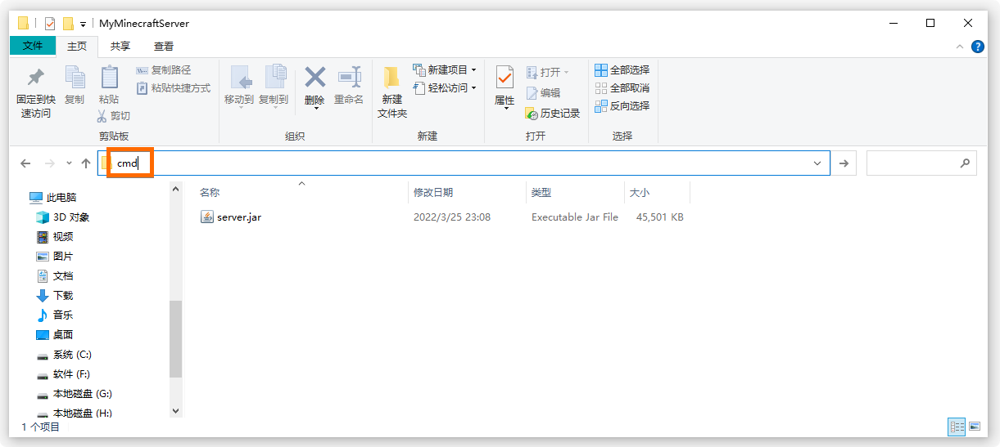
>
> 输入这串命令`java -Xmx1024M -Xms1024M -jar 这改为你的文件名.jar nogui`.如果你希望看到带有图形的界面,
 你也可以把`nogui`去掉
>
> 3.服务端会启动并且初始化,在屏幕里显示需要你同意协议的提示.
>
> 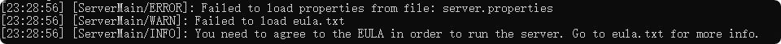
>
> 4.这是需要你查看根目录,里面会有一个协议文件`eula.txt`,将协议文件中的 `eula = false` 改为 `eula = true`.
> 
> 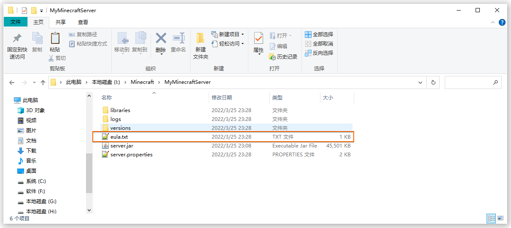
>
> 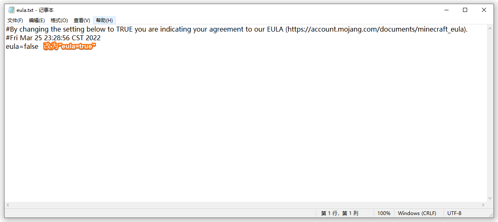
>
> **记得保存哦!!!**
>
> 5.重新启动服务端,等待初始化.
> 
>  当出现这样时,你成功的启动了你的服务器
>
> 
>
> 6.打开客户端,进入多人游戏,添加服务器.
>
> 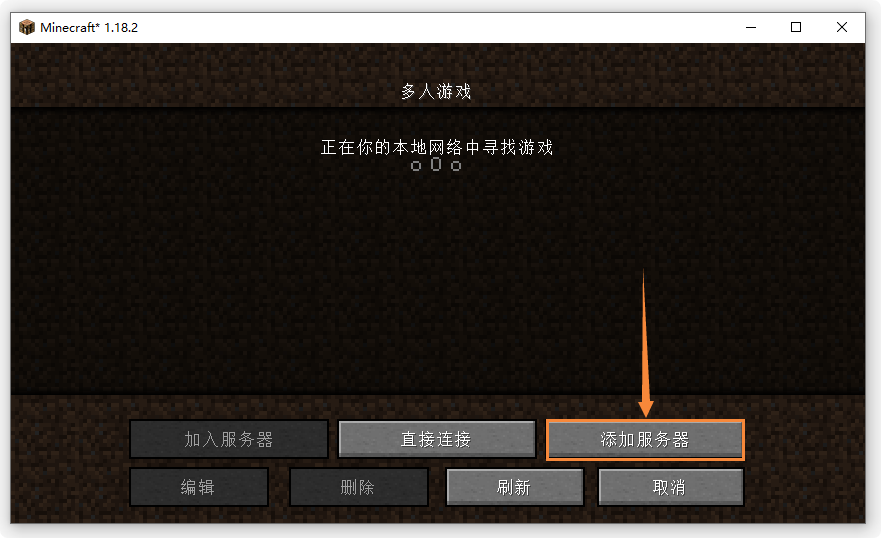
>
> 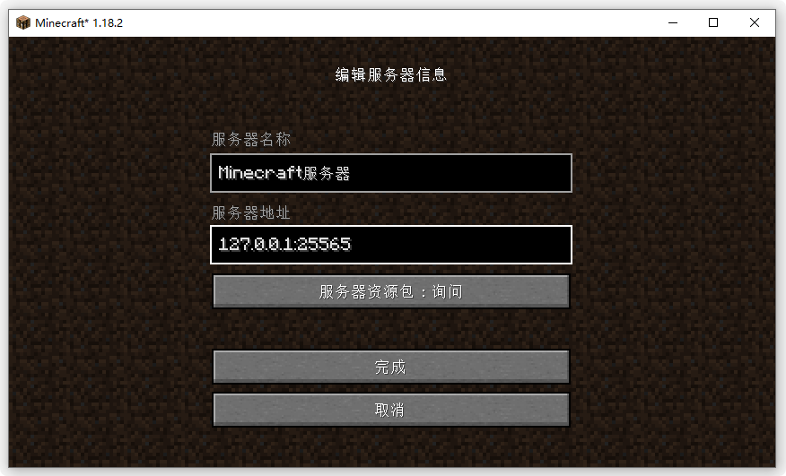
> 
> 其中 服务器名称 你可以随意取任何名字,在 服务器地址 这一栏填入环回地址.
>
> `:`后边的是端口号(强烈建议填写),因为我们并未对服务器做任何配置,所以默认开启的是25565端口.当然,因为是默认的端口,端口号可以不填.
>
> 7.开耍 [doge][doge].
>
## 服务器文件目录详解
> 经过以上步骤操作,你的根目录里一定含有这些文件.你大概不知道这些文件的作用吧,让我来告诉你.
> 
> |       文件名        |      内容            |
> | ------------------- |:-------------------- |
> |server.properties    |服务器设置             |
> |banned-ips.json      |被封禁的ip             |
> |banned-players.json  |被封禁的玩家           |
> |bukkit.yml           |这是Bukkit的主配置文件  |
> |permissions.yml      |权限配置文件,无需理会,可用其他插件代替|
> |help.yml             |默认系统指令           |
> |ops.json             |OP列表                 |
> |white-list.json      | 白名单 未开启白名单无需理会|
> |logs                 |服务器日志,所有在控制台中显示的内容里面都会保存|
> |plugins              |插件文件夹             |
> |world                |世界                   |
> |world_nether         |地狱                   |
> |world_the_end        |末地                   |
>

**server.properties**
?> 文件中`=`左边的变量名千万不要动,右边为空则为默认值
```conf
#Minecraft server properties
#（文件修改时间戳）
enable-jmx-monitoring=false
rcon.port=25575             #设置RCON远程访问的端口号
level-seed=                 #世界种子
gamemode=survival           #默认游戏模式,survival,creative,adventure,spectator
enable-command-block=false  #是否启用命令方块
enable-query=false          #允许使用GameSpy4协议的服务器监听器。用于获取服务器信息
generator-settings={}       #自定义世界的生成
level-name=world            #将作为世界名称及其文件夹名,自定义世界要改为你的世界名
motd=A Minecraft Server     #服务器欢迎信息,小于59个字符
query.port=25565            #设置监听服务器的端口号
pvp=true                    #是否允许PvP
generate-structures=true    #定义是否能生成结构(例如村庄)
difficulty=easy             #难度,peace,easy,
network-compression-threshold=256#压缩数据包大小限制,非常小的反而会变大.-1 完全禁用,0 完全启用
require-resource-pack=false #是否强制安装资源包,如果为true,玩家拒绝后会被踢出.
#尽量不要使用上面这个配置,因为有些玩家的电脑配置并不好

max-tick-time=60000         #设置每个tick花费的最大毫秒数,超过就崩溃.设定为-1,该项无效
use-native-transport=true   #仅在linux上生成,对于linux的优化
max-players=20              #服务器同时能容纳的最大玩家数量,经操作后op可以具有强制加入权
online-mode=true            #在线模式,即仅盗版进入
enable-status=true          #是否显示服务器状态
allow-flight=false          #允许飞行,如果为false,生存状态下的玩家悬空超过5秒就踢出
broadcast-rcon-to-ops=true  #向所有在线OP发送通过RCON执行的命令的输出
view-distance=10            #设置服务端发送给客户端的世界数据量(渲染距离)
server-ip=                  #将服务器与一个特定IP绑定.强烈建议留空该属性值!!!
resource-pack-prompt=       #对于资源包的自定义信息
allow-nether=true           #允许玩家进入下界
server-port=25565           #改变服务器(监听的)端口号
enable-rcon=false           #是否允许远程访问服务器控制台
sync-chunk-writes=true      #启用后区块文件以同步模式写入
op-permission-level=4       #op的权限
prevent-proxy-connections=false#
hide-online-players=false   #如果设为 true，服务端在响应客户端状态请求时不会返回在线玩家列表
resource-pack=              #材质包的地址
entity-broadcast-range-percentage=100 #实体渲染距离
simulation-distance=10      #设置服务端可更新实体范围的最大值
rcon.password=              #设置RCON远程访问的密码
player-idle-timeout=0       #如果不为0，服务器将在玩家的空闲时间达到设置的时间(单位为分钟)时将玩家踢出服务器
force-gamemode=false        #玩家进入游戏时的强制模式
rate-limit=0                #设置玩家被踢出服务器前，可以发送的数据包数量
hardcore=false              #极限模式
white-list=false            #是否开启白名单,开启后只有在whitelist.json里的玩家才可进入游戏
broadcast-console-to-ops=true#向所有op广播命令执行结果
spawn-npcs=true             #是否生成村民
spawn-animals=true          #是否生成动物
function-permission-level=2
level-type=default          #确定地图所生成的类型
text-filtering-config=
spawn-monsters=true         #决定攻击型生物（怪物）是否可以生成.如果difficulty=0（即难度设置为和平）的话，该属性值不会有任何影响

enforce-whitelist=false     #在服务器上强制执行白名单,true-不在白名单上的用户会被踢出.
#false-不在白名单上的在线用户不会被踢出

resource-pack-sha1=         #资源包的哈希值,用来校验
spawn-protection=16         #出生点保护
max-world-size=29999984     #最大世界
```
## 服主的自我素质修养
!> 待补充......