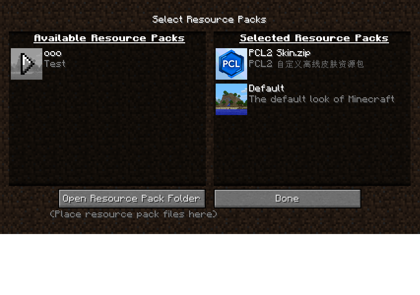
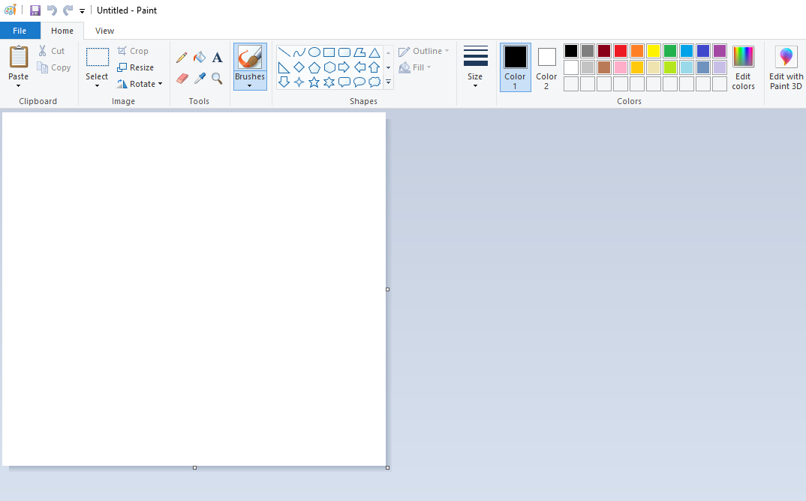
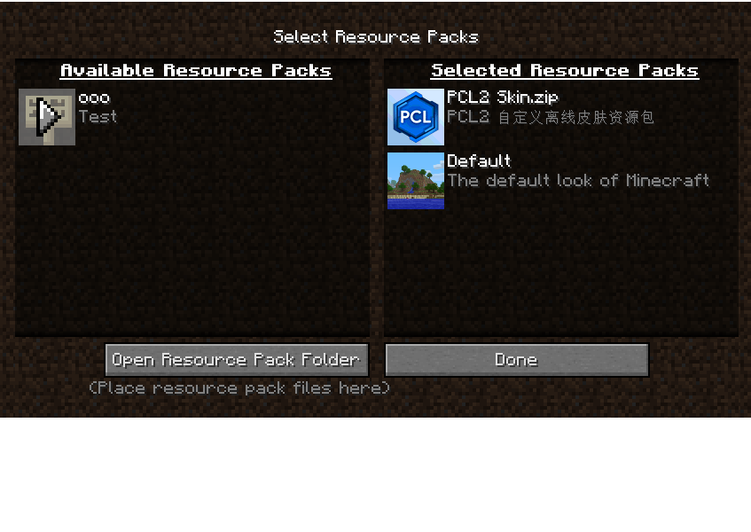
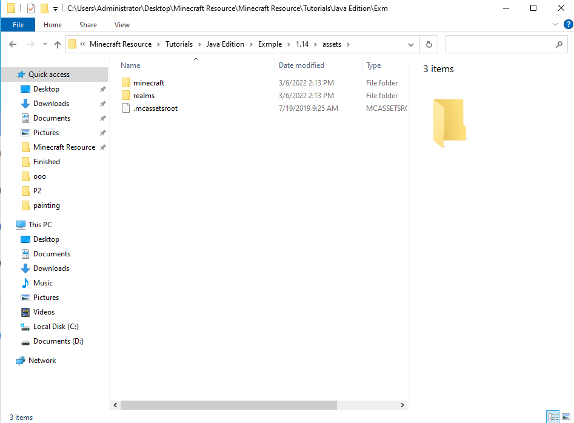
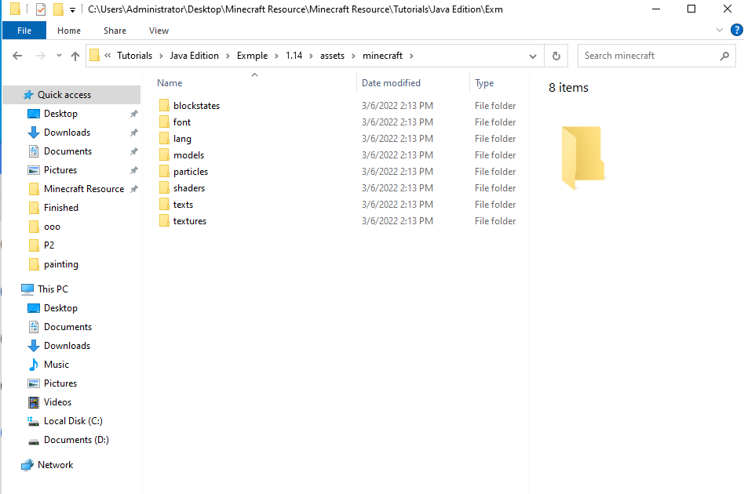
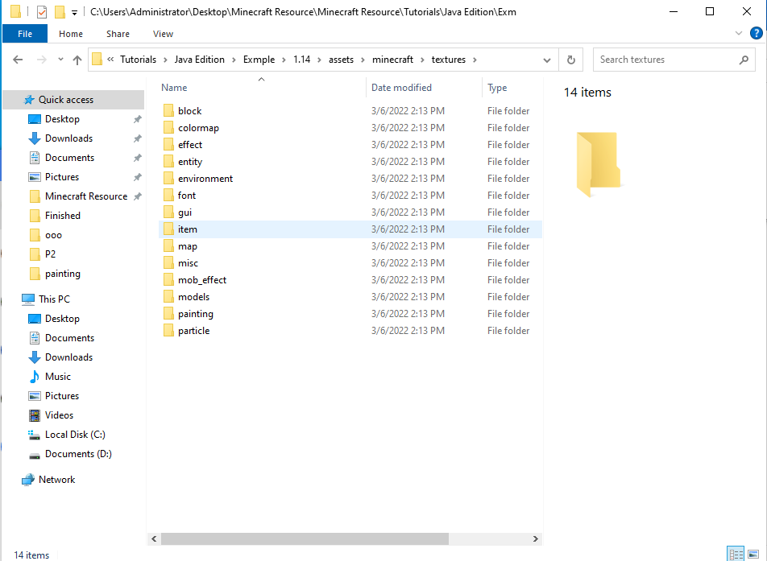
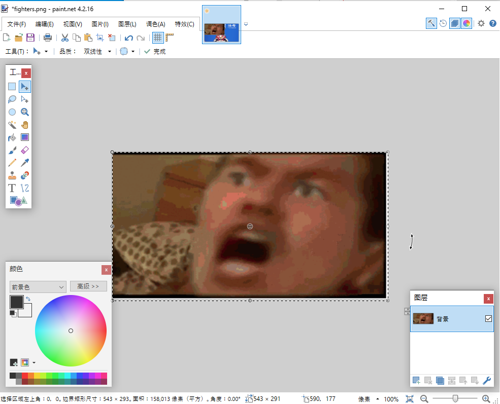

# 改变世界的样子

!> 本条目需要等待整改,正在施工中...

?> 本文更侧重教程而非开发手册,因此很多内容的完整格式并没有列出,请读者自行查阅相关资料.

## 什么是材质包
> 资源包(Resource Pack)系统允许玩家快速地自定义纹理、模型、唱片、声音、语言、终末之诗、闪烁标语、鸣谢名单等文本和字体.
>
> 在Minecraft中,材质包分为Java版与基岩版,其中Java版的材质包也被称作纹理包.
>
> 材质包可以与世界捆绑在一起,首先将材质包命名为resources.zip,然后将这个zip文件放入世界文件夹中.当游玩这个世界时,资源包会自动加载.
>
> 将服务器根目录里`server.propertie`s中地`resource-pack=`后面写入材质包的下载链接就能在服务器上设置默认资源包,但是玩家仍然可以选择是否使用这个材质包.

## 工具准备

> 一个编辑软件,本教程推荐使用Vscode 用于编写模型文件与.mcmeta介绍文件.  
> 为便于查看文件后缀,请将文件->文件夹选项->查看->隐藏已知文件类型的扩展名去掉勾选.

> 一个压缩软件,本教程推荐使用Vscode7z用于生成数据包和资源包地压缩工具.  
> (其他压缩软件也行)游戏本体文件也需要使用压缩软件来打开.
  
> 一个绘图软件,Windows自带的画图由于无法生成透明背景,因此不建议使用.  
> 我们可以使用[Paint.net](https://www.getpaint.net/)或其它绘图工具来绘制纹理. 

> 一个3D模型编辑器,本教程推荐使用BlockBench,因为它可以较为方便地将工程输出为.json格式.

> 一个音轨编辑器,Audacity可以迅速编辑你的音效.

## 创建材质包

> 打开.minecraft/versions/<对应版本>里的resourcepacks文件夹.  
> 创建一个新的文件夹,这个文件夹就是你的材质包的主文件夹,文件夹的名称即材质包的名称.
> 
> 文件夹都要按`正确`的名称与顺序填放,不然Minecraft不会加载文件
>
> 在ooo里创建文本pack.mcmeta,注意:不要保留原有的.txt;
>
> 在pack.mcmeta里写入缩小的代码:
>
> {"pack":{"pack_format":7,"description":"教程材质包"}}
>
> pack_format后面的数字代表了材质包所适用的版本
>
> 7则是1.17
>
> 6则是1.16.2-1.16.5
>
> 5则是1.15-1.16.1
>
> 4则是1.13-1.14
>
> 以此类推
>
> 在description后的双引号中写入你的材质包的介绍，在完成一系列操作后，按Ctrl+S保存。
> 
> 
> 接下来打开游戏就可以看见刚刚创建材质包了:
>
> 
> 
## 替换材质包的图标
>
> 有多种材质包的图标的添加方法,这里我们就自己画一个材质包,当然,你也可以选择去网上查找一个材质包的图标.
>
> 按下组合键win+r,输入mspaint来打开画图
> 
>
> 点击'Resize',如果你是中文的，那么可能不是Resize.将长宽都调成一样的,这意味着我们要造正方形!
>
> 记得取消保持长宽比!
> 
> 当你完成你的画作时,按Ctrl+S快速保存,保存到ooo里,重命名为pack.png,此后,这个文件就是你的材质包的图标了
>
> 
> 
## 替换游戏材质
> 按照上文基础部分给出的结构,在版本隔离开启的情况下找到.minecraft/versions/<对应版本号>/<对应版本号>.jar
>
> 鼠标右键它,使用任意一个压缩软件打开,将里面的assets文件夹解压到资源包主文件夹里,完成后,打开它.
>
> 
>
> 里面的两个文件夹分别是minecraft与realms
> 
> -minecraft 里储存的是原版游戏里所有的资源文件,如物品,方块等的材质,音效等
>
> -realms 里储存的是minecraft官方租聘服里的材质文件,因为官方租聘服在离线模式下不可用,所以忽略就好
>
> 我们再打开minecraft文件夹里看看:
>
> 
>
> 里面的文件各有大用,可是我们暂时只需要textures,这里面储存的是Minecraft原版所有的贴图文件,顺便说一下,lang文件夹里储存的是语言文件,你可以更改里面的键对值来修改游戏里显示的文字
>
> 可是有个缺陷是原版文件里只有en_US文件夹,这里面只会有你现在正在使用的语言文件.
>
> 好了让我们继续,打开textures文件夹里后,里面还有一堆文件夹,这些文件夹所储存的即是资源包的核心.
>
> 让我们看看这些文件夹的用途
>
> 
>
> block-方块贴图 items-物品贴图 
>
> environment-环境贴图 painting-画的贴图
>
> misc-杂项贴图 particle-粒子,如打村民时,村民会火冒金星.
>
> models-盔甲模型贴图 map-地图与地图上的标记
>
> gui-可视化界面,如合成栏的贴图 font-字体图片
>
> colormap-草方块在不同群系时使用的颜色 effect-里面只存了烟的文件，不过直译过来为'效果'
>
>
> 现在我们来制作一个奇妙的画
>
> 打开painting文件夹,选择要更改的材质,鼠标右键选择用paint.net打开.
> 
> 还是一样,完成你的作品后按ctrl+s保存,左侧工具栏就交给你们自己探索吧！
>
> 
>
> 话说这画怎么有点臭?
>
>
## 测试材质包
>
> 打开游戏后,到设置->材质包里去激活材质包,打开游戏后,如果想更改材质,那么不用退出,到游戏外把材质编辑好,回到游戏里后
>
> 用组合键F3+T重新加载就好.
>
> 我们得到了一个臭画!