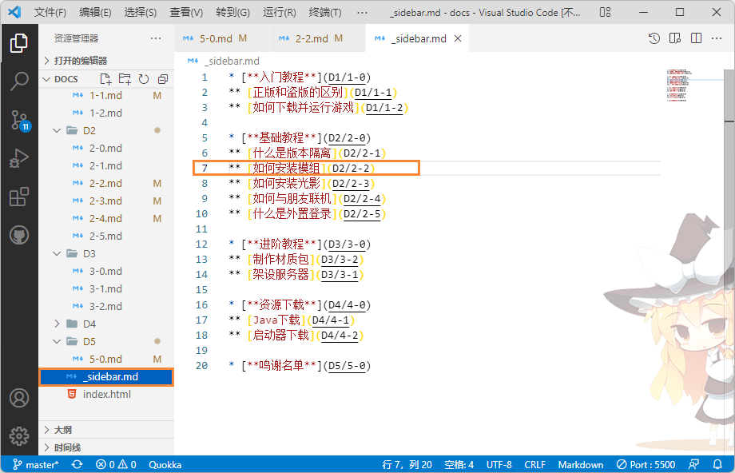
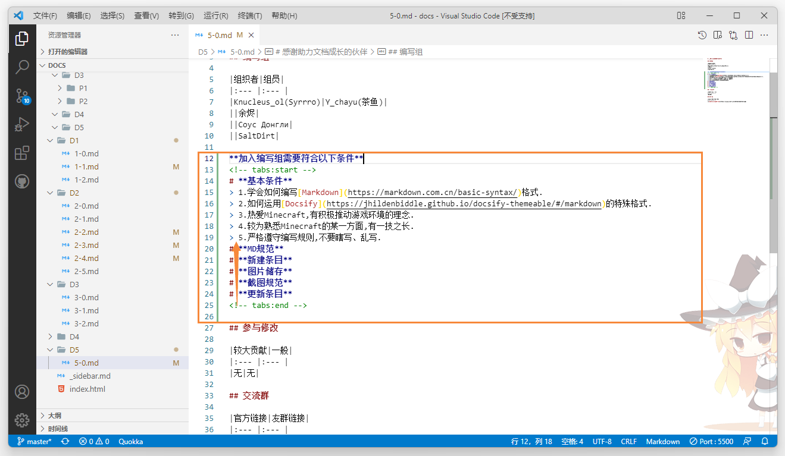
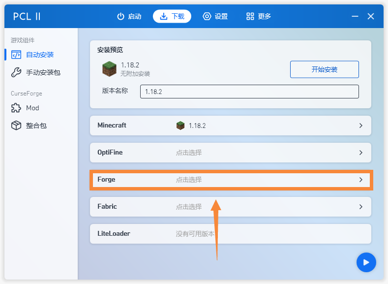

# 感谢助力文档成长的伙伴

## 编写组

|组织者|组员|
|:--- |:--- |
|Knucleus_ol(Syrrro)|Y_chayu(茶鱼)|
||余烬|
||Соус Донгли|
||SaltDirt|

**加入编写组需要符合以下条件**
<!-- tabs:start -->
# **基本条件**
> 1.学会如何编写[Markdown](https://markdown.com.cn/basic-syntax/)格式.  
> 2.如何运用[Docsify](https://jhildenbiddle.github.io/docsify-themeable/#/markdown)的特殊格式.  
> 3.热爱Minecraft,有积极推动游戏环境的理念.  
> 4.较为熟悉Minecraft的某一方面,有一技之长.  
> 5.严格遵守编写规则,不要瞎写、乱写.  
> 6.**最重要的是要有悟性!不收不能根据现有文档进行模仿学习的人!**
# **新增条目**
> 首先在群里询问条目所属章节.  
> 假设新增条目基础章节(D2)的如何安装模组(P2),那么这个文件名字就是`2-2.md`.  
> 此条目md文件储存位置就是`/D2`,图片储存位置就是`/assets/D2/P2`.  
> 然后在文档根目录的`_sidebar.md`文件中进行登记.  
> 
# **MD规范**
> 1.>标记符后要留一个空格,增强可读性.  
> 2.过密的地方要使用[Tabs标签](https://jhildenbiddle.github.io/docsify-themeable/#/markdown?id=tabs)进行整合.  
> 3.每一小节各各部分要合理规范、分段.  
> 4.不要使用中文标点,全篇使用英文标点,注意标点符号的用法.  
> 5.切记不要一段话不分行就硬塞,显得很乱.  
> 6.内容不要过于随意,要尽量用正式、清晰的方法进行叙述.  
> 7.输入英文名称要使用驼峰命名法.(例如: No forge → Forge)  
> 7.更多的要求请自行观察现有文档.
> 
# **截图规范**
> 标记符号要用橙色,截图大于750像素,最好小于900像素.  
> 有些软件截图到不了750像素,则要用群内的背景文件打底色.  
> 截取软件要带边框,有圆角的带圆角.   
> 
# **更新条目**
> 将你所写的条目md文件与小节图片的文件夹打包发到群内,并@群主.
<!-- tabs:end -->

## 参与修改

|较大贡献|一般|
|:--- |:--- |
|无|无|

## 交流群

|官方链接|友群链接|
|:--- |:--- |
|[我的世界萌新交流群](https://jq.qq.com/?_wv=1027&k=Xm2d4rm4)|无|